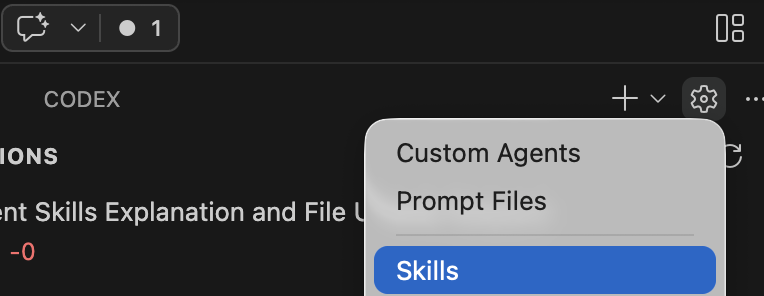

# Skills Lab 2: Agent Skills (Demo Notes)

## Agent Skills in One Line
Agent Skills are reusable instruction packs that teach the AI how to do specific jobs consistently.

## Simple Analogy
Think of the AI as a chef.  
Without skills, the chef cooks by memory and may vary each time.  
With skills, the chef follows tested recipe cards for each dish, so results are faster and more reliable.

## What Happens After You Type a Prompt
1. Agent reads prompt intent.
2. Checks skill `name` and `description`.
3. If matched: loads `SKILL.md` (and referenced skill files only when needed).
4. If not matched: uses base instructions and general best practices.

## Create a Skill in VS Code (Step by Step)

3. Create a folder for your skill.
	Example: `.github/skills/webapp-testing/`.
4. Create `SKILL.md` inside that folder.
5. Add required YAML frontmatter at the top:
	- `name`: lowercase, hyphenated, must match folder name (for example `webapp-testing`)
	- `description`: what it does + when to use it
6. Add the body content.
	Include purpose, when to use, step-by-step procedure, input/output examples, and references to local skill files.
7. (Optional) Add resources in the same skill folder.
	Examples: templates, helper scripts, or `examples/`.
8. Verify discovery and invocation.
	- Type `/` in chat to see skills.
	- Use `/skills` to open Configure Skills quickly.
	- Invoke directly, for example `/webapp-testing login page`.
9. Optional behavior control in frontmatter:
	- `user-invocable: false` to hide from `/` menu but still allow auto-loading.
	- `disable-model-invocation: true` to allow manual slash use only.
10. Optional fast path with AI:
	Type `/create-skill` and describe the capability; Copilot can scaffold the skill structure for you.

## What Is the Existing Problem?
- AI responses vary unpredictably.
- Team standards (style, security, docs) are often overlooked.
- New hires frequently repeat setup errors.
- Domain-specific guidance is scattered and hard to find.

## How Skills Solve These Issues
- Consistent results: tasks follow predefined patterns.
- Higher quality: embedded best practices ensure reliability.
- Faster workflows: reduced rework and fewer iterations.
- Simplified onboarding: reusable team knowledge accelerates learning.
- Predictable processes: relevant skills auto-load for tasks.

---

## Gaps in kids-learning-app & How to Fill Them

### Gap 1: Outdated JavaScript Syntax
**Problem**: Files like `main.js` and `quiz-mixed.js` use older patterns (`var`, function expressions).
**Solution**: `/code-refactoring modernize main.js`
**Expected Result**: Modern ES6+ syntax (const/let, arrow functions, template literals).

### Gap 2: Inconsistent Code Formatting
**Problem**: Spacing, indentation, and style rules vary across files.
**Solution**: `/linting-formatting format public/js/quiz-mixed.js`
**Expected Result**: Code follows kids-learning-app style guide (2-space indentation, semicolons, camelCase).

### Gap 3: Missing Function Documentation
**Problem**: Routes and functions lack JSDoc comments.
**Solution**: `/doc-generation document app.js routes`
**Expected Result**: JSDoc headers for all functions with @param, @returns, and @example tags.

### Gap 4: Unvalidated User Input
**Problem**: Quiz form inputs not sanitized; potential XSS vulnerabilities.
**Solution**: `/security-practices validate form inputs`
**Expected Result**: Input validation, allowlisting, and error handling applied.

### Gap 5: No API standardization
**Problem**: Quiz endpoints have inconsistent error handling and response formats.
**Solution**: `/api-standardization standardize quiz routes`
**Expected Result**: All routes follow consistent structure with proper error responses.

### Gap 6: Incomplete Test Coverage
**Problem**: No automated tests for quiz interactions.
**Solution**: `/webapp-testing create quiz test suite`
**Expected Result**: Playwright tests for user flows (answering questions, scoring, results).

### Gap 7: New Team Member Onboarding
**Problem**: New developers struggle with initial setup.
**Solution**: `/environment-setup new team member guide`
**Expected Result**: Automated setup checklist (Node version, dependencies, local config).

---

## Quick-Start Example: Complete Workflow

**Scenario**: Clean up `quiz-mixed.js` completely.

Run these prompts in order:
1. `/code-refactoring modernize quiz-mixed.js`
2. `/linting-formatting format quiz-mixed.js`
3. `/doc-generation document quiz-mixed.js`
4. `/security-practices review quiz-mixed.js`

**Compare**: Before and after outputs show transformation from legacy to production-ready code.

---

## Conclusion
"Our main issue was inconsistent AI output and repeated mistakes. Agent Skills fix this by acting like tested recipe cards for common engineering tasks. We pick the right skill, load it first, follow the instructions, and validate the result. That gives us faster delivery, consistent quality, and easier onboarding."
