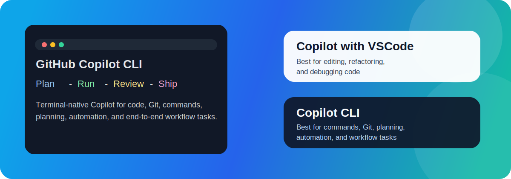
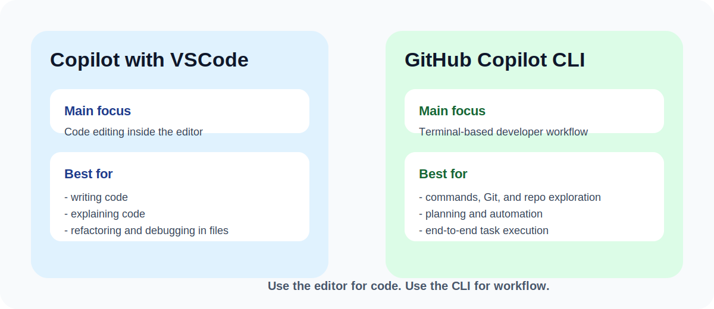
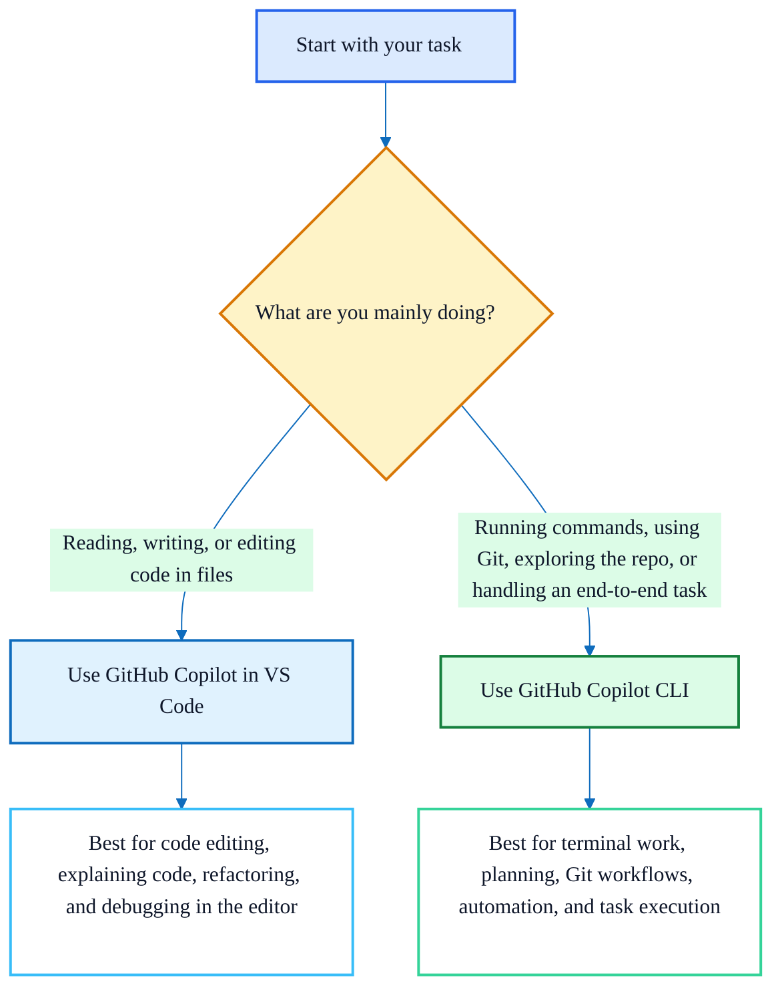

# GitHub Copilot CLI: In Short

> 🚀 Copilot in VS Code helps you inside the editor.
> 
> 💻 Copilot CLI helps you across the wider developer workflow.

## ✨ What It Is

GitHub Copilot CLI brings Copilot into the terminal.

Use it when the task is more than just editing code.

- 🔎 exploring a repository
- 🧪 running shell commands
- 🌿 working with Git
- 🧭 handling multi-step work from one prompt
- 🔁 taking a GitHub task through implementation and review

## 🆚 Why Not Only VS Code?

GitHub Copilot in VS Code works best when you are reading, writing, and editing code in the editor.

It is great for:

- ✍️ inline code generation
- 📖 explaining code in files
- 🛠️ refactoring while viewing source
- 🐞 debugging with visual context

But many developer tasks start outside the editor.

For example:

- 📂 understanding a repo from the terminal
- 📝 summarizing recent commits
- 📋 checking logs and command output
- ✅ running tests and fixing failures
- 🔗 working with GitHub issues, PRs, and workflows

That is exactly where Copilot CLI helps.

## 🎨 Core Difference

Think of it as a simple choice:

- Use VS Code Copilot when the work is centered on files and code changes in the editor.
- Use Copilot CLI when the work includes terminal steps, Git steps, or a broader workflow around the code.

## 🎯 What Challenges Copilot CLI Solves

- 🔄 Reduces context switching between terminal, GitHub, and editor
- 🧩 Handles tasks that mix code, commands, and Git
- ⚡ Helps new contributors understand a repo faster
- 🧠 Supports longer sessions instead of one-off prompts
- 🤖 Makes repeatable engineering tasks easier to automate

## 🌈 Additional Advantages

- 🖥️ Fits naturally into terminal and Git workflows
- 📌 Plan mode to think before making changes
- 💾 Session memory and resume support for longer tasks
- 🔌 MCP support to connect external systems such as GitHub
- 🚚 Delegation and parallel work for larger tasks
- ⚙️ Programmatic mode for scripting and automation

## 🧠 Simple Rule of Thumb

Use VS Code Copilot when you are mainly editing code.

Use Copilot CLI when the task includes terminal commands, Git workflows, planning, or full task execution.

## 🎤 One-Line Summary

VS Code Copilot helps you write code faster.

Copilot CLI helps you move faster across the full developer workflow.